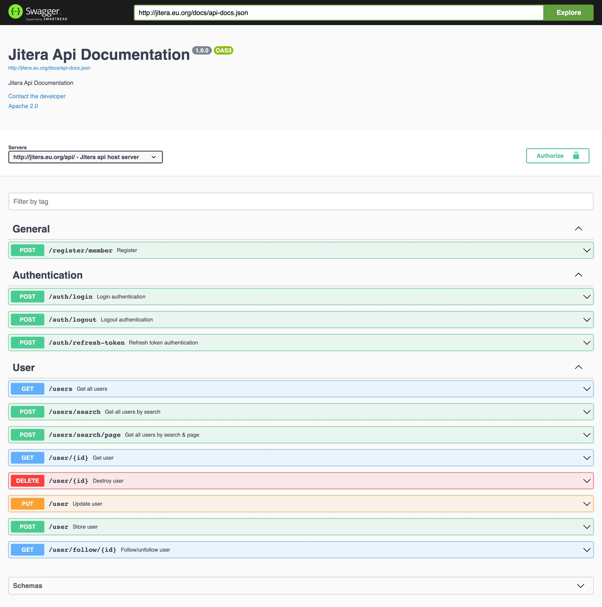
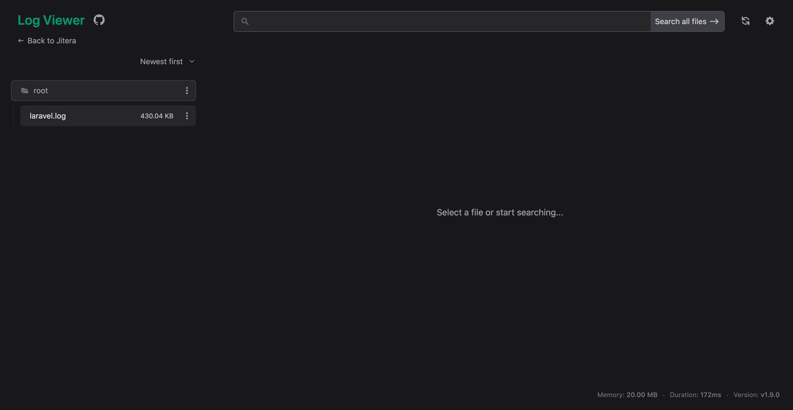

# Jitera User Follow/UnFollow Api

## Project setup
Create your local project root folder
```
$ mkdir jitera && cd jitera
```
Get clone project source 
```
$ git clone https://github.com/satryawiguna/jitera.git . -b develop
```

## Do some adjust to .env file configuration value
```
APP_URL=http://localhost

DB_CONNECTION=mysql
DB_HOST=jit_mysql
DB_PORT=3306
DB_DATABASE=jitera
DB_USERNAME=root
DB_PASSWORD=root
DB_TABLE_PREFIX=jit_

DB_HOST_TEST=jit_mysql
DB_PORT_TEST=3306
DB_DATABASE_TEST=jitera_test
DB_USERNAME_TEST=root
DB_PASSWORD_TEST=root

L5_SWAGGER_CONST_HOST="http://localhost/api/"
```

### Compiles and hot-reloads for development
Make sure you have installed docker in your local
```
$ docker-compose up -d
```
Execute run.sh file
```
$ ./run.sh -s jit_api
```
Make sure docker container services has been run properly
```
$ docker ps -a
```
Run init
```
$ docker exec -t -i /bin/bash -c "composer update"
$ docker exec -t -i /bin/bash -c "php artisan migrate"
$ docker exec -t -i /bin/bash -c "php artisan passport:install --uuids"
$ docker exec -t -i /bin/bash -c "php artisan db:seed"

```

### Run unit test
```
$ docker exec -t -i jit_api /bin/bash -c "php artisan test"
```


### Swagger API Documentation


```
Production:
http://jitera.eu.org/api/documentation

Staging:
http://stg.jitera.eu.org/api/documentation
```

### Postman API Documentation
```
http://jitera.eu.org/postman-api-documentation.json
```

### Log View Activity

```
production:
http://jitera.eu.org/log

staging:
http://stg.jitera.eu.org/log
```
